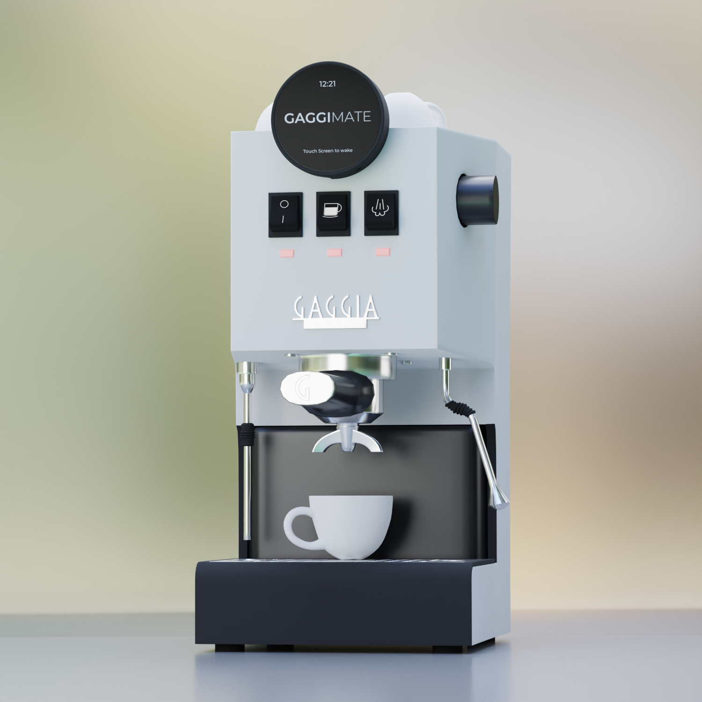
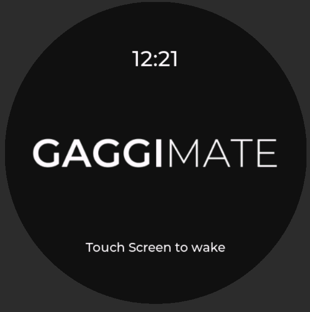
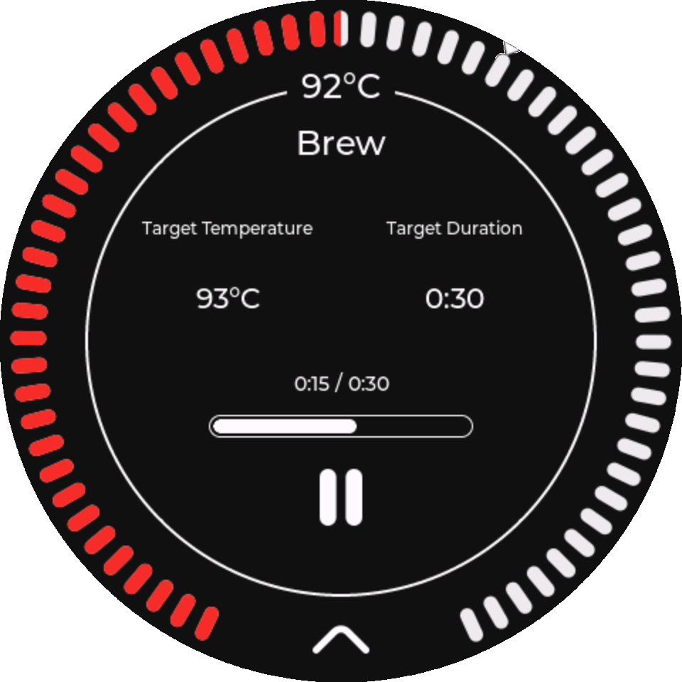
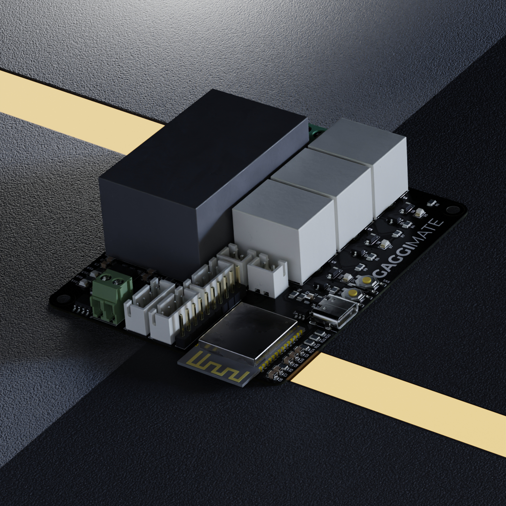

 
  

[![CC BY-NC-SA 4.0][cc-by-nc-sa-shield]][cc-by-nc-sa]
[![Sonar QG][sonar-shield]][sonar-url]
[![Sonar Violations][sonar-violations]][sonar-url]
[![Sonar Tech Debt][sonar-tech-debt]][sonar-url]

This project upgrades a Gaggia espresso machine with smart controls to improve your coffee-making experience. By adding a display and custom electronics, you can monitor and control the machine more easily.

## Features

- **Temperature Control**: Monitor the boiler temperature to ensure optimal brewing conditions.
- **Brew timer**: Set a target duration and run the brewing for the specific time.
- **Steam and Hot Water mode**: Control the pump and valve to run the respective task.
- **Safety Features**: Automatic shutoff if the system becomes unresponsive or overheats.
- **User Interface**: Simple, intuitive display to control and monitor the machine.

## Screenshots and Images

### Group Buy for kits

The first round of the group buy is filled up but I'll keep the form open. You can register there to get notified about the second round which will hopefully start at the beginning of 2025.

https://forms.gle/KEXdpgJGCZbsFdKD7

## How It Works

The display allows you to control the espresso machine and see live temperature updates. If the machine becomes unresponsive or the temperature goes too high, it will automatically turn off for safety.

## Docs

The docs were moved to [https://gaggimate.eu/](https://gaggimate.eu/). You can find all sourcing and assembly information there.

## License

This work is licensed under CC BY-NC-SA 4.0. To view a copy of this license, visit https://creativecommons.org/licenses/by-nc-sa/4.0/

[sonar-violations]: https://img.shields.io/sonar/blocker_violations/jniebuhr_gaggimate?server=https%3A%2F%2Fsonarcloud.io&style=for-the-badge
[sonar-shield]: https://img.shields.io/sonar/quality_gate/jniebuhr_gaggimate?server=https%3A%2F%2Fsonarcloud.io&style=for-the-badge
[sonar-tech-debt]: https://img.shields.io/sonar/tech_debt/jniebuhr_gaggimate?server=https%3A%2F%2Fsonarcloud.io&style=for-the-badge
[sonar-url]: https://sonarcloud.io/project/overview?id=jniebuhr_gaggimate
[cc-by-nc-sa]: http://creativecommons.org/licenses/by-nc-sa/4.0/
[cc-by-nc-sa-image]: https://licensebuttons.net/l/by-nc-sa/4.0/88x31.png
[cc-by-nc-sa-shield]: https://img.shields.io/badge/License-CC%20BY--NC--SA%204.0-lightgrey.svg?style=for-the-badge
