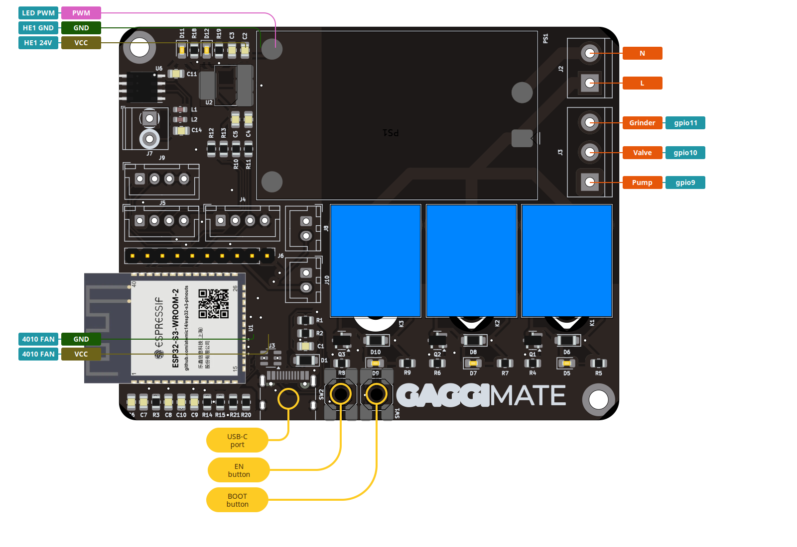
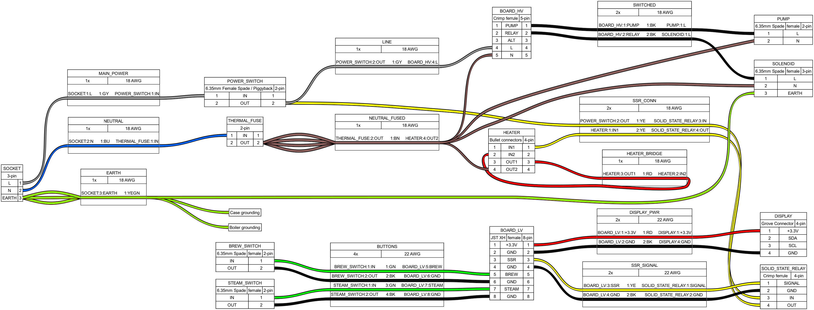
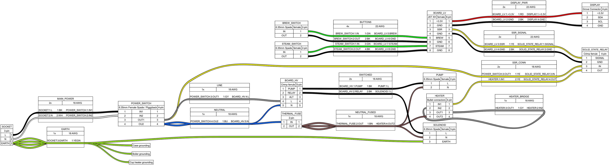

 
  

[![CC BY-NC-SA 4.0][cc-by-nc-sa-shield]][cc-by-nc-sa]
[![Sonar QG][sonar-shield]][sonar-url]
[![Sonar Violations][sonar-violations]][sonar-url]
[![Sonar Tech Debt][sonar-tech-debt]][sonar-url]

This project upgrades a Gaggia espresso machine with smart controls to improve your coffee-making experience. By adding a display and custom electronics, you can monitor and control the machine more easily.

## Features

- **Temperature Control**: Monitor the boiler temperature to ensure optimal brewing conditions.
- **Brew timer**: Set a target duration and run the brewing for the specific time.
- **Steam and Hot Water mode**: Control the pump and valve to run the respective task.
- **Safety Features**: Automatic shutoff if the system becomes unresponsive or overheats.
- **User Interface**: Simple, intuitive display to control and monitor the machine.

## Screenshots and Images

## BOM

AliExpress links provided are affiliate links and supporting the project.

### PCB Build

The recommended way to build this machine is to use the PCB designed for this project.

The first round of the group buy is filled up but I'll keep the form open. You can register there to get notified about the second round which will hopefully start at the beginning of 2025.

https://forms.gle/KEXdpgJGCZbsFdKD7

#### Pinout

Here you can see where to connect which components. This is also printed on the back of the PCB.

### Lego Build

If you do not want to use the PCB you can buy the components on their own:

- **ESP-S3 DevKit** https://s.click.aliexpress.com/e/_EzXyAvP (N8R8)
- **2-Channel 5V Relay** https://s.click.aliexpress.com/e/_ExUVY9J (2 or 3 channel if you want the Grinder integration)
- **MAX6675 Temperature sensor board** https://s.click.aliexpress.com/e/_EG1t3V7 (Module)

### General components

- **LilyGo T-RGB 2.1" Display** https://s.click.aliexpress.com/e/_Eju6rYD (Full Circle)
- **AC SSR** https://s.click.aliexpress.com/e/_EvPScvr (SSR-40DA)
- **K-Type M4 Thermocouple** https://s.click.aliexpress.com/e/_Exzhqx7 (K-Type M4 0.5m)
- **22 AWG Silicone Wire for LV wiring** https://s.click.aliexpress.com/e/_EH7UMS8
- **18 AWG Silicone Wire for HV wiring** https://s.click.aliexpress.com/e/_EJEs0ak

## Display Case
- **4pcs 6x3mm Neodymium Magnet** https://s.click.aliexpress.com/e/_EjwXuaU

## Tools
- Wire stripper or knife
- **Crimping tool** https://a.aliexpress.com/_EuVLJ9A (SNA02C-06-06WF-58B) - This one will do all the crimps required in the build
- Screwdriver 
- Zipties (good to have)
- Cable labels/tape (good to have)

## How It Works

The display allows you to control the espresso machine and see live temperature updates. If the machine becomes unresponsive or the temperature goes too high, it will automatically turn off for safety.

## Installation

The installation process of this mod consists of purely electrical changes. You will have to wire up the 3-Way valve and pump to the relays provided on the board.
The existing thermostats of your machine have to be removed and bridged while connecting the heater to the SSR instead. The M4 thermistor goes into the screw hole where the brew
thermostat would usually sit.

I will soon update this with detailed instructions.

## Wiring Diagrams

### Gaggia Classic

### Gaggia Classic Pro

## Docs

The docs were moved to https://github.com/jniebuhr/gaggimate-docs

## License

This work is licensed under CC BY-NC-SA 4.0. To view a copy of this license, visit https://creativecommons.org/licenses/by-nc-sa/4.0/

[sonar-violations]: https://img.shields.io/sonar/blocker_violations/jniebuhr_gaggimate?server=https%3A%2F%2Fsonarcloud.io&style=for-the-badge
[sonar-shield]: https://img.shields.io/sonar/quality_gate/jniebuhr_gaggimate?server=https%3A%2F%2Fsonarcloud.io&style=for-the-badge
[sonar-tech-debt]: https://img.shields.io/sonar/tech_debt/jniebuhr_gaggimate?server=https%3A%2F%2Fsonarcloud.io&style=for-the-badge
[sonar-url]: https://sonarcloud.io/project/overview?id=jniebuhr_gaggimate
[cc-by-nc-sa]: http://creativecommons.org/licenses/by-nc-sa/4.0/
[cc-by-nc-sa-image]: https://licensebuttons.net/l/by-nc-sa/4.0/88x31.png
[cc-by-nc-sa-shield]: https://img.shields.io/badge/License-CC%20BY--NC--SA%204.0-lightgrey.svg?style=for-the-badge
